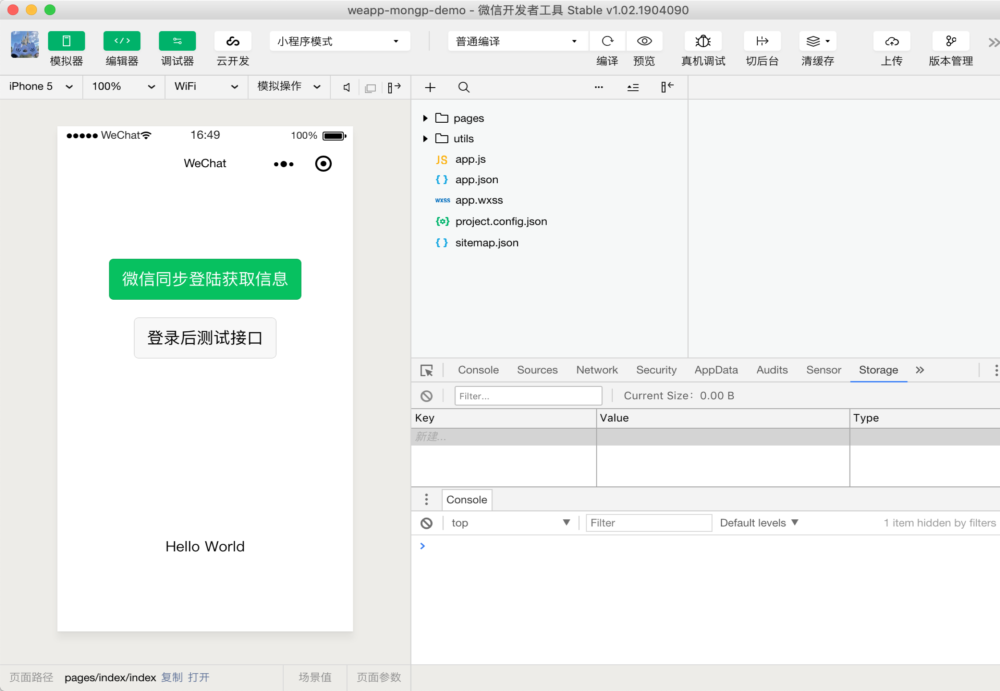
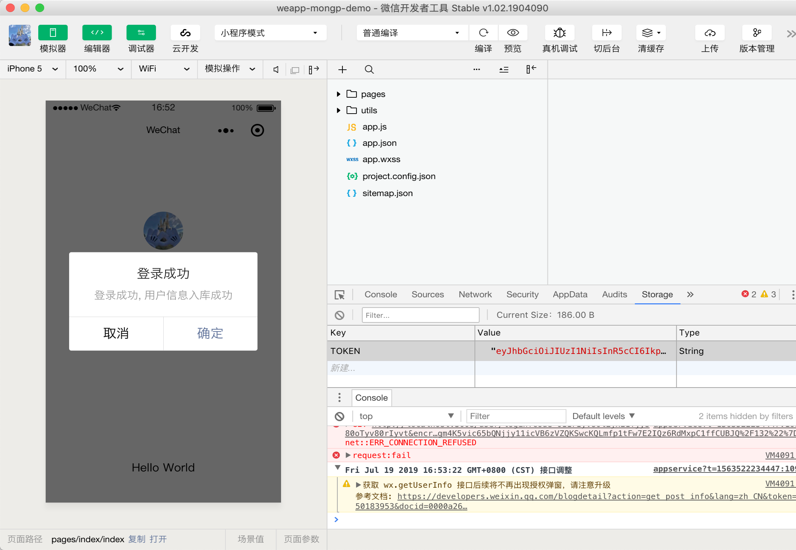
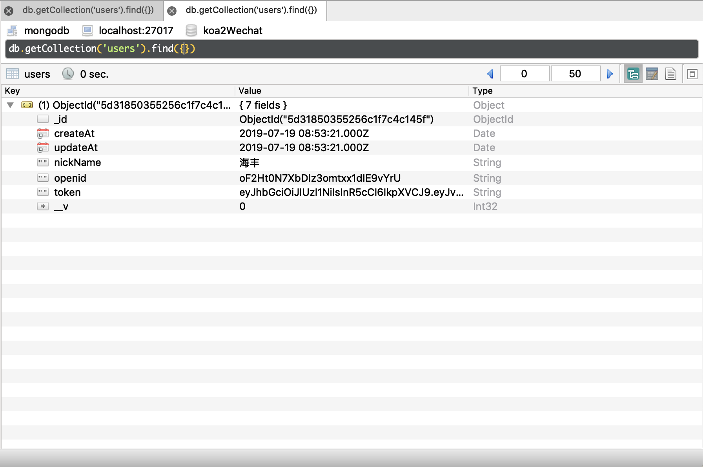
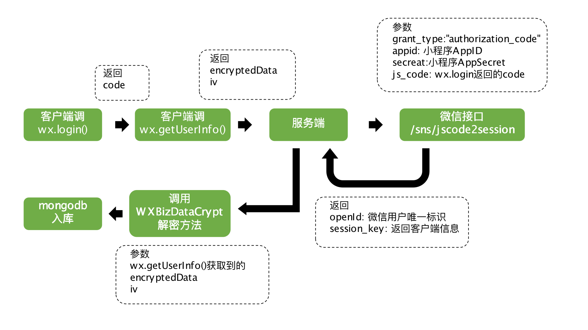

# weapp-node-mongo-scaffold
此项目为解决微信小程序与mongodb数据互通，科实现微信小程序同步登陆获取用户信息，使用koa2 + mongoose结构，使用koa-jwt鉴权

## 项目运行

1. Clone项目
```
git clone https://github.com/seawind8888/weapp-node-mongo-scaffold my-project
```

2. 安装依赖
```
cd my-porject
npm install 或 yarn
```


3. 参数设置
```
confing/index.js设置参数

app: {
    port: 3008, // 项目开启端口
    whiteList: [/\/user\/login/]  // 无需session验证白名单
},
weapp: {
    AppID: "xxx", // 微信AppID
    AppSecret: "xxxxxx" 微信AppSecret
}
```

4. 运行项目
```
npm run dev
```

## 运行示例小程序
> 请先启动项目，参照项目运行

1. 使用微信开发者工具导入项目目录下example项目，并填入自己申请的**AppID**

2. 进入项目，**关闭详情 - 不校验合法域名**


3. 点击微信同步登陆，提示用户入库成功，并返回session_key和token（可存入storage并加入请求header）


4. mongo入库用户信息成功

> Tips:  客户端调用wx.login生成token，实际有两个鉴权逻辑（微信鉴权，客户端交互token鉴权），客户端可先使用wx.checkSession判断微信鉴权，再获取客户端鉴权

## 同步登陆流程

微信官方文档只给了[微信登录流程图](https://developers.weixin.qq.com/miniprogram/dev/framework/open-ability/login.html)，但并没有给出**同步数据库**登录的流程。并且各种openId、sessionKey、iv等相关的鉴权字段也是搞得人很懵逼，按照自己轮流程做了个图，供参考


## 目录结构
```
├── config/ 
│ ├── index.js            # 项目参数设置
├── controllers/          # 处理路由映射函数中心
├── controllers/          # 小程序示例项目
├── middleware/           # 中间件目录
├── model/                # mongo模型目录
├── routes/               # koa路由目录
├── .babelrc              # babel配置
├── app.js                # 项目启动模块
├── index.js              # 项目启动入口
├── pm2.config.json       # pm2配置目录
└──  package.json         # 项目信息
```
